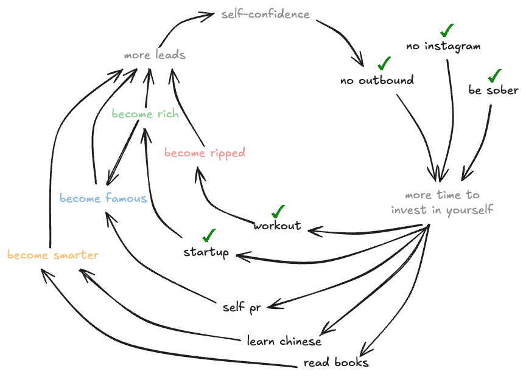

- getting started with my new website!
	- i think markdown is great. i'm used to using it and know (nearly) all the syntaxes. it follows the philosophy for hyprnote as well - file-based systems are king. (yes even this is markdown)
	- but at the same time i don't trust myself from NOT losing my files or devices. i do want a backup and that would be github for me - yes, i am betting that microsoft will not fck up and die.
- the ultimate flywheel
	- 
	-