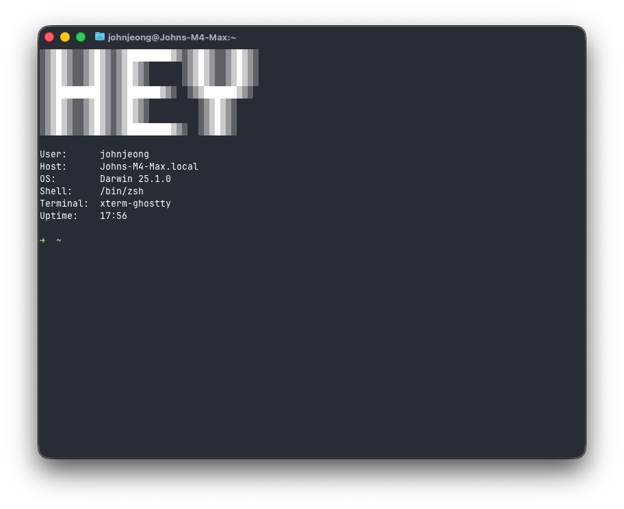

- char - the open-source ai notepad for meetings
	- **char** is short for [character](https://en.wikipedia.org/wiki/Character_(computing)) - which is basically text
	- `char` is used as a [data type in C](https://en.wikipedia.org/wiki/Character_(computing)#char) - it is one _byte_ and i think **char** is helping people digest information in _bite_ sizes
	- yujong and i are engineers (some might argue i'm not one but i consider myself as one) so we like this quirky name
	- also our product is a notepad/taker which captures "words"
	-
- hmmm need to sort out my thoughts - got so many things going on
	- (urgent) need to really work on decap editor - harshika is dependent on it
	- need to sort out sprint 2 and 3 - got so many issues popping up and need to prioritize things
	- got so many things to develop in the desktop app too
	- new design
		- buy domain
		- communicate with legal counsel
		- logo, colors, animations
	- 외국환거래신고
-
- image to ascii art seems like a fun project to do https://ianparberry.com/art/ascii/shader/
	- cool https://www.asciiart.eu/image-to-ascii
- let's also try to customize my terminal
	- 
- got no time for sketching these days. i gotta get better at product design!
- vibes https://www.youtube.com/watch?v=pRnr9hRooAM