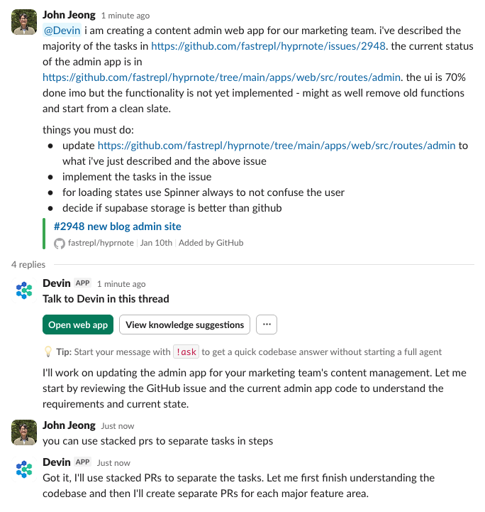

- todos
	- draft prd for content admin and get devin to work on it. i think the ui work is already done. just need to perfect the functionality. specify in https://github.com/fastrepl/hyprnote/issues/2948
		- upload new blog post which will be used as an example for future blog posts. attach to prd - after deciding if we should use github vs supabase.
		- lfg devin
		- 
	- desktop-related fix is really needed.
	- test https://github.com/fastrepl/hyprnote/pull/3025
	- chat with harshika about landing pages
	- follow-up with overnice
	- ~~follow-up with brent~~
	- make devin figure this out: https://github.com/fastrepl/hyprnote/pull/2927
	- need to write a post: markdown is all you need
- some tedious tasks
	- add hide dock icon in settings
	- add hide tray icon in settings
	-
- great stuff by anaclumos https://coscientist.app
-