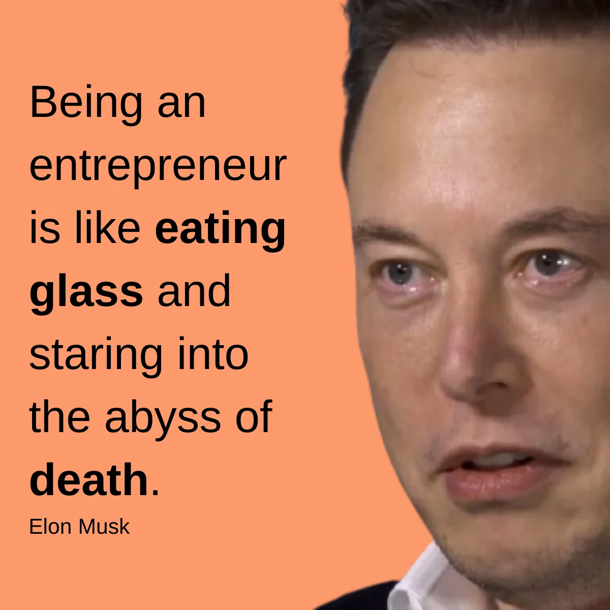

- hyprnote blog:
	- john's story (interview format)
	- yujong's story (interview format)
	- how we work at hyprnote - show off our company handbook
-
- johnjeong.com:
	- [computers](https://en.wikipedia.org/wiki/Computer_(occupation)) were humans in the past
	- bodybuilding and startups are identical - you can't always do the stuff you like to do. (elon said his journey is like looking into the abyss while eating glass)
		- 
	- github is the ultimate project management tool
	- 예쁨과 아름다움의 차이 - 성당에서 부둥켜 안고 있던 사람들을 보며
	- act, not react - 주체성이란 무엇일까?
	- social media and echo chamber - this is more of a study that i want to do
	- 납땜 하나 못하는 전기과 졸업생이 말이 되냐?